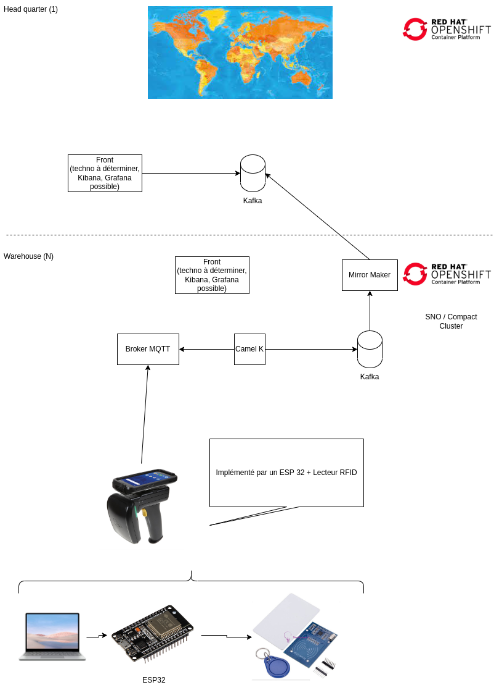

# RHTE Edge Lab

## Description

*From the ESP32 to the OpenShift cluster: discover what Red Hat can offer for the Edge computing!*

*Through the common theme of "shipment tracking", this lab will help you understand what Red Hat can offer for the Edge computing.*

*In this lab, you will be at the head of a "parcel shipment hub" and you will deploy a everything needed to : read the parcel RFID (using arduino and ESP32), send data to a MQTT broker over wifi, transform those data using Camel-K and send relevant events to the headquarter for reporting.*

*An application at the headquarter will display the parcels moving from one hub to another in realtime.*

*Fun is expected !*

## Lab Materials

## Prerequisites

## Schema

## Instructions
